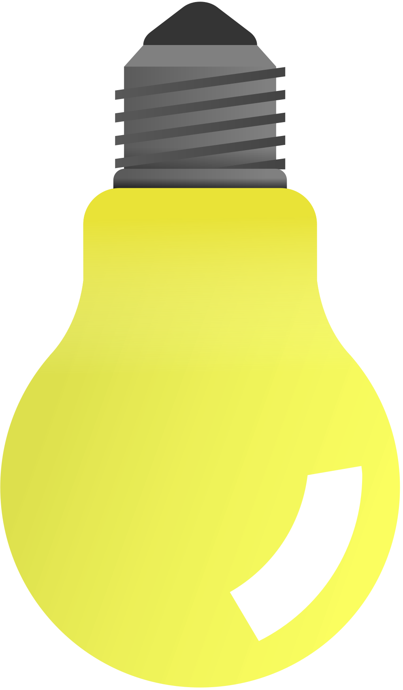

Exercício Ligar e Desligar a Lampâda

Crie uma página com a imagem de uma lâmpada apagada, e que ao clicar a lâmpada acenda.
Utilizar imagens e manipulação do DOM para mudar a imagem da lâmpada ao clicar na lâmpada.

Solução Proposta:

HTML

    <body>

    <h1>Ligar e Desligar a Lâmpada</h1>    
    

        
    

    </body>

CSS
    body {
    background-color: black;
    }
    h1 {
        margin-top: 200px;
        color: white;
        font-family: sans-serif;
        font-size: 3em;
        text-align: center;    
    }
    h1:hover {
        text-shadow: 0 0 25px #ffb62f;
    }
    div {
        position: absolute;
        top: 50%;
        left: 50%;
        transform: translate(-50%,-50%);
    }
    #lamp {
        position: absolute;
        top: 50%;
        left: 50%;
        transform: translate(-50%,-50%);
        width: 250px;
    }

JAVASCRIPT
    var lampada = document.getElementById("lamp");

        lampada.addEventListener("click", function() {
            if (lampada.src.includes("Imagens/ONLampada.png")) {
                lampada.src = "Imagens/OFFLampada.png";
            } else {
                lampada.src = "Imagens/ONLampada.png";
            }
    });

